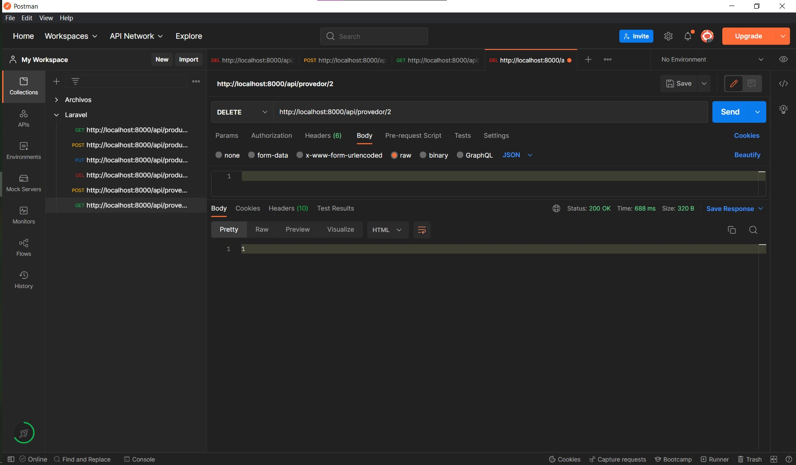
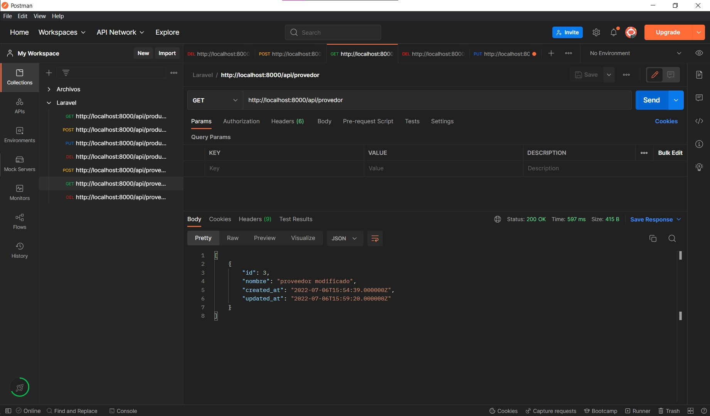

# Laravel-Crud
Para realizar este proyecto se utilizó Homestead, homestead es un entorno de desarrollo local que nos provee una serie de herramientas como lo son el lenguaje PHP y base de datos como lo es MariaDB.
Para la instalación de esta herramienta se utilizó la documentación oficial de Homestead Laravel:

https://laravel.com/docs/9.x/homestead

Para poder ejecutar los comandos que ahí se mencionan se necesitan los siguientes programas:

* VirtualBox
* Vagrant
* Git
* Visual Studio Code (algun otro editor de código)

CONSEJO: Si se tiene corriendo DockerDesktop o una Base de Datos en el puerto 3306 lo mejor será detener esos servicios para evitar inconvenientes.


##  Los comandos que se generan a continuación se realizaron a través de una ventana de Git Bash:

Se generó una caja de laravel homestead:
```
vagrant box add laravel/homestead
```
Se clonó el repositorio de Homestead:

```
git clone https://github.com/laravel/homestead.git ~/Projects/Homestead
```
Se deberá ingresar a la carpeta Homestead.

Se deberá de pasar de la rama master a la release con el siguiente comando:
```
git checkout release.
```
En la carpeta se encontrará un archivo YAML, en el que se debe de editar una linea:


En el area de sitios de deberá de poner, justo despues de /code/ el nombre del proyecto que se planea crear por ejemplo, "project".

Se deberán crear claves SSH:
```
 ssh-keygen -t rsa -C "you@homestead"
```

Ya con estos comandos tendremos listo el entorno para poder levantarlo. Los comandos de Vagrant utilizados son:
* vagrant up: para levantar la maquina.
* vagrant halt: para apagar la máquina.
* vagrant reload --provision: para reiniciar la máquina.


Iniciada por primera vez la máquina se deberá de instalar el paquete de laravel. Esto solo se hace la primera vez:
```
composer require laravel/homestead --dev
```

Para utilizar la base de datos ya incluida con Homestead se deberá ingresar con el siguiente comando:
```
mysql -u homestead -p
```

La contraseña por defecto es "secret" y si se desea se puede generar otro usuario y contraseña para utilizarlos en el proyecto.

Para crear nuestro proyecto nos movemos a la carpeta code:
```
cd code
```

Dentro de ella creamos nuestro proyecto, como se dijo anteriormente se llamara project.
```
laravel new project
```

Esto nos generará un .env, donde se debe de setear el usuario, contraseña y nombre de la base de datos que nosotros escojamos.

Los comandos utilizados para este proyecto fueron:
* php artisan make:model {nombre} -a 

Este lo utilizamos para crear modelos de datos a ingresar.

* php artisan migrate

Este lo utilizamos para migrar los modelos a la base de datos

* php artisan serve

Este lo utilizamos para correr el servidor laravel para nuestra api.

En este proyecto se tienen 2 tablas, una de producto y otra de proveedor a continuación se muestra un ejemplo del CRUD que genera cada uno de ellos:

## PRODUCTO
* Ingresar


* Ver


* Editar


* Eliminar


 
* Resultado final


## PROVEEDOR
* Ingresar

* Ver

* Editar

* Eliminar

* Resultado final
